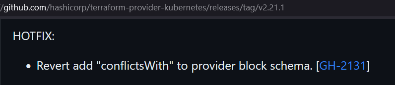
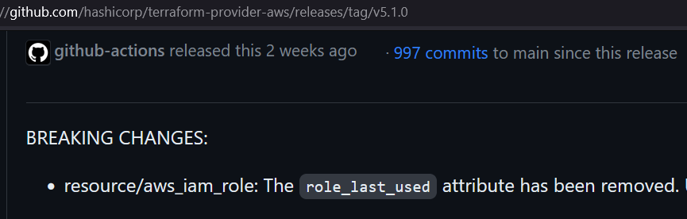
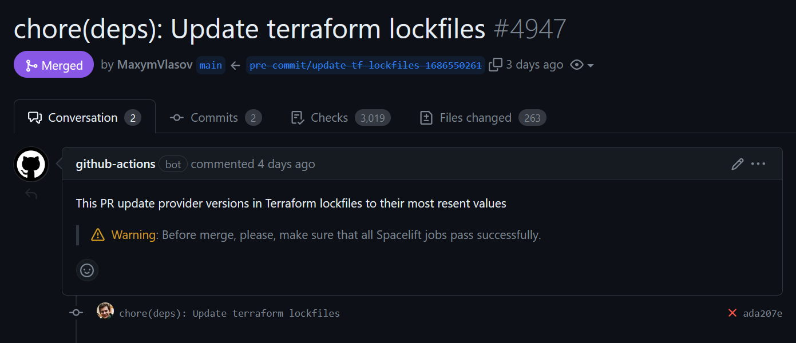
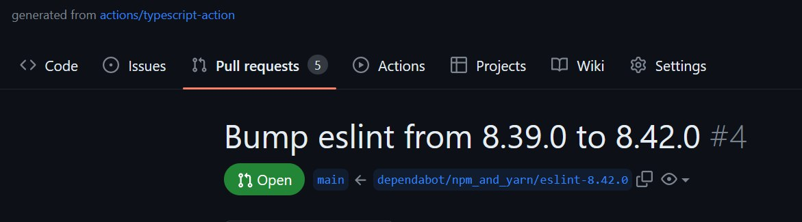
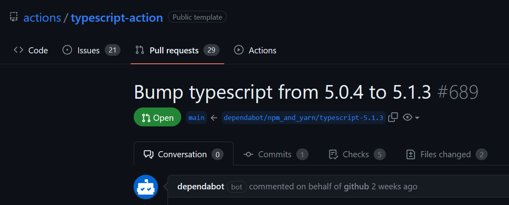

# Як безболісно додавати, використовувати та оновлювати `.terraform.lock.hcl`

## Передісторія

Як ви знаєте, у Terraform 1.4.0 запроваджено [зміни](https://github.com/hashicorp/terraform/pull/32129), які ломають попередню неправильну поведінку. Раніше ви могли ігнорувати лок-файл та використовувати закешовані провайдери так довго, як version constraints в коді були сумісними з ваши локальним кешем. Починаючи з 1.4.0, Terraform дивиться в лок-файл перед тим, як подивитись що лежить в кеші. На практиці це означає, що якщо ви проігноруєте лок-файл або повністю видалите його, Terraform запустить повну ініціалізацію, незалежно від того, що знаходиться у ваших `TF_CACHE_DIR` та `.terraform/`.

Отже, є [кілька варіантів](https://github.com/runatlantis/atlantis/issues/3201), щоб вирішити це:

* Продовжити використовувати Terraform 1.3.x як новий 0.11
* Додати `TF_PLUGIN_CACHE_MAY_BREAK_DEPENDENCY_LOCK_FILE=true`
* Почати використовувати лок-файл та рухатись далі

Коли зник останній промінь надіх на те, що наш чудовий робочий процес із `**/.terraform.lock.hcl` у `.gitignore` не буде поламаний взад, я вирішив спробувати додати `.terraform.lock.hcl` до всіх наших 289 рут модулів. Ви можете запитати:

## Навіщо потрібні ці лок-файли?

Що ж, окрім "дуже рекомендованого Hashicorp'ом рішення", який фактично змушує вас використовувати лок-файл, існують додаткові причин, чому ви хотіли б їх використовувати — повторюваність і безпека.

### Повторюваність

Уявимо що у вас є провайдер `aws` або `kubernetes` і ви вірите, що мейнтейнери використовують [SemVer](https://semver.org/) правильно. Тож ви вказуєте:

```terraform
terraform {
  required_version = "~> 1.3"

  required_providers {
    aws = {
      source  = "hashicorp/aws"
      version = "~> 5.0"
    }
    kubernetes = {
      source  = "hashicorp/kubernetes"
      version = "~> 2.0"
    }
  }
}
```

Все працює добре, допоки...

* Провайдер був зламаний протягом 3 робочих днів через відсутність тестування ¯\\\_(ツ)\_/¯

   


* Мейнтейнери провайдера додають breaking changes в мінорний реліз, оскільки вони _забули_ додати їх в мажорний

   

І обидві ці ситуації виникли протягом одного місяця.

Звичайно, ви можете пінити версії провайдерів включно з патч-версіями. Наприклад, `"5.0.0"` або `"2.19.0"` і використовувати Renovate/dependabot або [`tfupdate` pre-commit хук](https://github.com/antonbabenko/pre-commit-terraform#tfupdate) для контрольованих оновлень. З плюсів, з `tfupdate` ви зафорсите використання лише однієї версії terraform/провайдера/модуля в усьому коді. 

Таким чином ви уникнете проблем, описаних вище. Однак це ще не все.

### Безпека

Всередині `.terraform.lock.hcl` є всі ці `h1` і `zh` [хеші](https://developer.hashicorp.com/terraform/language/files/dependency-lock#hashes):

```hcl
provider "registry.terraform.io/hashicorp/kubernetes" {
  version     = "2.21.1"
  constraints = ">= 2.21.1, < 3.0.0"
  hashes = [
    "h1:2spGoBcGDQ/Csc23bddCfM21zyKx3PONoiqRgmuChnM=",
    "h1:7cCH+Wsg2lFTpsTleJ7MewkrYfFlxU1l4HlLWP8wzFw=",
    "h1:I1qWLUFmB0Z8+3CX+XzJtkgiAOYQ1nHlLN9lFcPf+zc=",
    "h1:gP8IU3gFfXYRfGZr5Qws9JryZsOGsluAVpiAoZW7eo0=",
    "zh:156a437d7edd6813e9cb7bdff16ebce28cec08b07ba1b0f5e9cec029a217bc27",
    "zh:1a21c255d8099e303560e252579c54e99b5f24f2efde772c7e39502c62472605",
    "zh:27b2021f86e5eaf6b9ee7c77d7a9e32bc496e59dd0808fb15a5687879736acf6",
    "zh:31fa284c1c873a85c3b5cfc26cf7e7214d27b3b8ba7ea5134ab7d53800894c42",
    "zh:4be9cc1654e994229c0d598f4e07487fc8b513337de9719d79b45ce07fc4e123",
    "zh:5f684ed161f54213a1414ac71b3971a527c3a6bfbaaf687a7c8cc39dcd68c512",
    "zh:6d58f1832665c256afb68110c99c8112926406ae0b64dd5f250c2954fc26928e",
    "zh:9dadfa4a019d1e90decb1fab14278ee2dbefd42e8f58fe7fa567a9bf51b01e0e",
    "zh:a68ce7208a1ef4502528efb8ce9f774db56c421dcaccd3eb10ae68f1324a6963",
    "zh:acdd5b45a7e80bc9d254ad0c2f9cb4715104117425f0d22409685909a790a6dd",
    "zh:f569b65999264a9416862bca5cd2a6177d94ccb0424f3a4ef424428912b9cb3c",
    "zh:fb451e882118fe92e1cb2e60ac2d77592f5f7282b3608b878b5bdc38bbe4fd5b",
  ]
}
```

Terraform використовує їх для завантаження ідентичних артефактів для вашої платформи, які використовувалися під час останньої `terraform init` і, як наслідок, `terraform apply` команди.

Це зменшує ймовірність [supply chain attack](https://en.wikipedia.org/wiki/Supply_chain_attack), коли найслабшою ланкою у вашому ланцюжку залежностей є терраформ провайдери.

## Підготовка до додавання лок-файлів

> **Примітка**: у всіх наведених нижче прикладах я використовував GitHub Workflows. Однак ви можете портувати їх на будь-який інший CI.

Перш за все, вам потрібно мати валідний терраформ код.

І ви не можете просто взяти і пропустити цей крок, якщо у вас багато terraform-коду: майже напевно щось десь буде зламано.

Отже, дозвольте представити вам команду `terraform validate`! Жартую. Але це саме те, що нам треба. Також для валідація буває потрібно виконати `terraform init -backend=false`, який потрібно запустити у всіх рут-модулях.

Для цього випадку існує рішення на базі `pre-commit`, яке інітить ваші модулі (і виправляє існуючі `.terraform`, якщо вони застарілі/зламані), і запускає валідацію. Для його використання необхідно:

1. [Встановити залежності будь-яким способом, описаним у `pre-commit-terraform`](https://github.com/antonbabenko/pre-commit-terraform#how-to-install).
2. Створити файл `.github/.pre-commit-tf-lockfiles.yaml` із наведеним нижче вмістом:

    > **Примітка**: пізніше ми будемо використовувати цей файл для автоматичного оновлення лок-фалйів в CI. `.github/` присутній у шляху до файлу лише для того, щоб приховати його від звичайних користувачів і покласти файл якомога ближче до `.github/workflows/`

    ```yaml
    repos:
      - repo: https://github.com/antonbabenko/pre-commit-terraform
        rev: v1.81.0
        hooks:
          - id: terraform_validate
            args:
              - --hook-config=--retry-once-with-cleanup=true
              - --tf-init-args=-upgrade
            # files: '^path/to/your/terraform/root/folder/[a-c]'
            exclude: '(\.)?modules/'

          # - id: terraform_providers_lock
          #   args:
          #   - --hook-config=--mode=always-regenerate-lockfile
          #   - --args=-platform=linux_arm64
          #   - --args=-platform=linux_amd64
          #   - --args=-platform=darwin_amd64
          #   - --args=-platform=darwin_arm64
          #   files: '^path/to/your/terraform/root/folder/[a-c]'
          #   exclude: '(\.)?modules/'
    ```

3. Якщо у вас величезний репник, розкоментуйте наступний рядок і вкажіть правильний шлях `# files: '^path/to/your/terraform/root/folder/[a-c]'`  

     `files` і `exclude` використовує Python `re.search` синтаксис ([docs](https://pre-commit.com/#regular-expressions)). Вказавши `[a-c]` в кінці, ми можемо обмежити кількість директорій, які повинні бути пройдені протягом наступного запуску

4. Запустіть команду та відпочиньте пару хвилин

    ```bash
    pre-commit run -a --config .github/.pre-commit-tf-lockfiles.yaml
    ```

5. Після завершення команди перевірте щоб всі рут-модулі пройшли валідацію. Якщо ні, виправте помилки та повторно запустіть `pre-commit`, доки всі модуля не будуть валідними.

6. Відредагуйте свій `.gitignore`, щоб не ігнорувати файли блокування. Наприклад:

    ```txt
    !path/to/your/terraform/root/folder/[a-c]*/.terraform.lock.hcl
    !path/to/your/terraform/root/folder/[a-c]*/**/.terraform.lock.hcl
    ```

## Додайте лок-файли

1. Перейдіть до раніше створеного `.github/.pre-commit-tf-lockfiles.yaml` і:

     * Розкоментуйте `terraform_providers_lock` хук
     * Задайте ваші [`-platform=`'и](https://developer.hashicorp.com/terraform/registry/providers/os-arch)
     * Скопіюйте `files` і `exclude` секції з `terraform_validate` до `terraform_providers_lock`
     * Закоментуйте `terraform_validate` хук аби заощадити трохи часу

2. Запустіть команду нижче. Ця займе набагато більше часу ніж перша команда, тож ви можете паралельно робити щось інше

    ```bash
    pre-commit run -a --config .github/.pre-commit-tf-lockfiles.yaml
    ```

     У моїх тестах це зайняло близько 2,5с на платформу на провайдера на рут-модуль. Тож, щоб створити лок-файл для модуля з 6 провайдерами і з 4 платформами, вам знадобитися приблизно 1 хвилина.

3. Переконайтеся, що всі лок-файли мають `zh` хеші для кожного провайдера.

     Не забудьте видалити порожні файли, створені в розділі "Підготовка" для директорій без terraform коду.

     Якщо деякі лок-файли не мають усіх необхідних хешів, перевірте логи. У більшості випадків це означає, що ви все ще використовуєте щось старе із Terraform 0.11, яке не підтримує одну з указаних платформ (у моєму випадку `-platform=darwin_arm64` для `hashicorp/template` і `mumoshu/helmfile`)

4. Якщо ви також зіткнулися з цими проблемами, змініть `.github/.pre-commit-tf-lockfiles.yaml` і перезапустіть `pre-commit`:

    ```yaml
     - id: terraform_providers_lock
        args:
          - --hook-config=--mode=always-regenerate-lockfile
          - --args=-platform=linux_arm64
          - --args=-platform=linux_amd64
          - --args=-platform=darwin_amd64
          - --args=-platform=darwin_arm64
        exclude: |
          (?x)
            (/(\.)?modules/

            # hashicorp/template 2.2.0 is not available for darwin_arm64
            |^terraform/bootstrap/
            # mumoshu/helmfile 0.14.0 is not available for darwin_arm64.
            |^terraform/helmfiles/
          )

      # TODO: Rewrite these modules to newer providers
      - id: terraform_providers_lock
        name: Lock terraform provider versions w/o darwin_arm64
        args:
          - --hook-config=--mode=always-regenerate-lockfile
          - --args=-platform=linux_arm64
          - --args=-platform=linux_amd64
          - --args=-platform=darwin_amd64
        files: |
          (?x)
            # hashicorp/template 2.2.0 is not available for darwin_arm64
            (^terraform/bootstrap/
            # mumoshu/helmfile 0.14.0 is not available for darwin_arm64.
            |^terraform/helmfiles/
          )
    ```

     > **Примітка**: щоб заощадити час, ви можете закоментувати останній хук для генерації наступних групи лок-файлів.

## Автоматизація оновлення лок-файлів у CI

Як ви матимете всі лок-файли, настане час автоматизувати їх оновлення.

1. Перейдіть до `.github/.pre-commit-tf-lockfiles.yaml` і:

     * Змініть `terraform_validate` `files` секції на:

        ```yaml
        files: '\.terraform\.lock\.hcl$'
        ```

         щоб обмежити запуск `terraform init` лише для директорій з лок-файлами.

     * Видаліть `files` у `terraform_providers_lock` хуках

     У підсумку ви отримаєте щось на зразок цього:

    ```yaml
    repos:
      - repo: https://github.com/antonbabenko/pre-commit-terraform
        rev: v1.81.0
        hooks:
          - id: terraform_validate
            args:
              - --hook-config=--retry-once-with-cleanup=true
              - --tf-init-args=-upgrade
            files: '\.terraform\.lock\.hcl$'

        - id: terraform_providers_lock
            args:
              - --hook-config=--mode=always-regenerate-lockfile
              - --args=-platform=linux_arm64
              - --args=-platform=linux_amd64
              - --args=-platform=darwin_amd64
              - --args=-platform=darwin_arm64
            exclude: |
              (?x)
                (/(\.)?modules/

                # hashicorp/template 2.2.0 is not available for darwin_arm64
                |^terraform/bootstrap/
                # mumoshu/helmfile 0.14.0 is not available for darwin_arm64.
                |^terraform/helmfiles/
              )

          # TODO: Rewrite these modules to newer providers
          - id: terraform_providers_lock
            name: Lock terraform provider versions w/o darwin_arm64
            args:
              - --hook-config=--mode=always-regenerate-lockfile
              - --args=-platform=linux_arm64
              - --args=-platform=linux_amd64
              - --args=-platform=darwin_amd64
            files: |
              (?x)
                # hashicorp/template 2.2.0 is not available for darwin_arm64
                (^terraform/bootstrap/
                # mumoshu/helmfile 0.14.0 is not available for darwin_arm64.
                |^terraform/helmfiles/
              )
    ```

2. Додайте GitHub workflow, який встановлює всі залежності та запускає `pre-commit run` щопонеділка і створюватиме новий PR в Renovate-стилі:

    ```yaml
    name: Maintain Terraform lockfile up-to-date
    # It is required at least Renovate fixes https://github.com/renovatebot/renovate/issues/22417

    on:
      workflow_dispatch: {}

      schedule:
        - cron: '0 4 * * 1' # Execute every Monday at 04:00

    permissions:
      contents: write
      pull-requests: write


    env:
      # Prevent GH API rate-limit issue
      GITHUB_TOKEN: ${{secrets.GITHUB_TOKEN}}

    jobs:
      pre-commit-tf-lockfile:
        runs-on: ubuntu-latest
        container: python:3.11-slim
        steps:
        - name: Install container pre-requirements
          run: |
            apt update
            apt install -y \
                git \
                curl \
                unzip \
                jq \
                nodejs # Needed for Terraform installation
            curl -L https://github.com/mikefarah/yq/releases/latest/download/yq_linux_amd64 > /usr/bin/yq &&\
              chmod +x /usr/bin/yq
        - name: Checkout
          uses: actions/checkout@c85c95e3d7251135ab7dc9ce3241c5835cc595a9 # v3.5.3
          with:
            ref: ${{ github.base_ref }}

        - uses: actions/checkout@c85c95e3d7251135ab7dc9ce3241c5835cc595a9 # v3.5.3
        - run: |
            git config --global --add safe.directory /__w/infrastructure/infrastructure
            git fetch --no-tags --prune --depth=1 origin +refs/heads/*:refs/remotes/origin/*

        - uses: hashicorp/setup-terraform@633666f66e0061ca3b725c73b2ec20cd13a8fdd1 # v2.0.3
          with:
            terraform_version: ~1.3

        - name: Execute pre-commit
          uses: pre-commit/action@646c83fcd040023954eafda54b4db0192ce70507 # v3.0.0
          with:
            extra_args: >
              --all-files
              --config .github/.pre-commit-tf-lockfiles.yaml
              --color=always --show-diff-on-failure

        - name: Create Pull Request
          if: failure()
          id: cpr
          uses: peter-evans/create-pull-request@284f54f989303d2699d373481a0cfa13ad5a6666 # v5.0.1
          with:
            commit-message: 'chore(deps): Update terraform lockfiles'
            branch: pre-commit/update-tf-lockfiles
            delete-branch: true
            title: 'chore(deps): Update terraform lockfiles'
            body: >
              This PR update provider versions in Terraform lockfiles to their most resent values

              > **Warning**: Before merge, please, make sure that all Terraform CI runs pass successfully.
            labels: auto-update
            branch-suffix: timestamp

        - name: Pull Request number and link
          if: failure() && steps.cpr.outputs.pull-request-number > 0
          run: |
            echo "Pull Request Number - ${{ steps.cpr.outputs.pull-request-number }}"
            echo "Pull Request URL - ${{ steps.cpr.outputs.pull-request-url }}"
    ```

    

    Для 289 рут-модулів із 1180 секціями провайдерів в лок-файлах, це займає 2 години 40 хвилин або ~2,288с на платформу на провайдера, що приблизно на 0,2 с швидше, ніж локально.

І це все з технічної точки зору. Настав час відповісти на запитання: _Чому б тобі просто не використати для цього Renovate, чуваче?_

### Чому не Renovate?

Так, я чув і про Renovate і про dependabot. Напр, я розказував про Renovate на [HUG Kyiv](https://www.youtube.com/live/uK8QgE17dzg?feature=share&t=3012) і на [стрімі Антона Бабенка](https://www.youtube.com/live/l28pukLJvss?feature=share)(Eng).

Ми не використовуємо dependabot для інфра репи, оскільки він має забагато проблем із монорепами; ви не можете просто [форсувати використання `dependabot.yml` для всієї організації](https://heyko.medium.com/automated-dependabot-configuration-in-github-bb08e2c6eeeb); він менш конфігурабельний, ніж Renovate тощо.

<details><summary>Сам GitHub неправильно використовує dependabot у своїх репозиторіях...</summary>

* Щойно створений репозиторій із [actions/typescript-action](https://github.com/actions/typescript-action) містить

     

* Dependabot PR живе тижнями!

     

</details>

Я підтримую Renovate для своєї організації тут: [Sharable Config Presets for Renovatebot, especially useful for DevOps folks](https://github.com/SpotOnInc/renovate-config/). Крім того, Renovate має опцію [`lockFileMaintenance`](https://docs.renovatebot.com/configuration-options/#lockfilemaintenance), але...

* Наразі Renovate не сприймає [`!=`](https://developer.hashicorp.com/terraform/language/expressions/version-constraints#version-constraint-syntax) version constrain ([renovate/#22417]( https://github.com/renovatebot/renovate/issues/22417)), тому він просто не може створити PR, якщо принаймні один version constrain з `!=` потрапить в "список оновлення".
* Якщо у вас немає `!=`, Renovate створить красиві PRи, але не врахує обмеження провайдерів вказані всередині child-модулів використані у вашому рут-модулі.

     Таким чином, ви отримаєте щось накшталт

    ```hcl
    provider "registry.terraform.io/hashicorp/aws" {
    version     = "5.2.0"
    constraints = "~> 5.0"
    ```

    у випадках, коли команда `terraform providers lock` створить щось накшталт

    ```hcl
    provider "registry.terraform.io/hashicorp/aws" {
    version     = "5.2.0"
    constraints = ">= 2.0.0, >= 3.0.0, >= 3.64.0, >= 4.0.0, >= 4.9.0, >= 4.18.0, >= 4.22.0, >= 4.23.0, >= 4.49.0, ~> 5.0"
    ```

    І воно працюватиме добре, доки хтось всередині цих модулів не вкаже `!= 5.2.0` або `< 5.2.0`.

* Renovate визначає всі доступні  `h1` хеші (усі доступні платформи провайдерів), що чудово. Тим не менш, він не вказує "базові" `zh` хеші, які, на мою думку, є [більш суворими](https://developer.hashicorp.com/terraform/language/files/dependency-lock#zh). Тому я віддаю перевагу наявності `zh` хешів, коли це можливо.

І ще одне:

## Додавайте лок-файли до всіх нових рут-модулів

Просто введіть правило для ваших тераформ-конфігурацій:

**Виконайте `terraform init`, при додаванні нового рут-модуля.**

Це додасть додає базовий `.terraform.lock.hcl`, який ви можете закомітити як є та почекати наступної CI-джоби з оновлення лок-файлів.

Або, ви можете додати `.pre-commit-config.yaml` з:

```yaml
repos:
  - repo: https://github.com/antonbabenko/pre-commit-terraform
    rev: v1.81.0
    hooks:
      # Validate and run `terraform init` which needed for terraform_providers_lock
      - id: terraform_validate
        args:
          - --hook-config=--retry-once-with-cleanup=true
      - id: terraform_providers_lock
        args:
          - --hook-config=--mode=only-check-is-current-lockfile-cross-platform
          - --args=-platform=linux_arm64
          - --args=-platform=linux_amd64
          - --args=-platform=darwin_amd64
          - --args=-platform=darwin_arm64
        ## TODO: Rewrite these modules to newer providers
        # exclude: |
        #   (?x)
        #     (/(\.)?modules/

        #     # hashicorp/template 2.2.0 is not available for darwin_arm64
        #     |^terraform/bootstrap/
        #     # mumoshu/helmfile 0.14.0 is not available for darwin_arm64.
        #     |^terraform/helmfiles/
        #   )
```

І автоматизувати запуск `pre-commit` в PR-ах, як [тут](https://github.com/antonbabenko/pre-commit-terraform/blob/32597545e7fff922a19c3b3c7cecf3fd6bc6b628/.github/workflows/pre-commit.yaml) або [тут](https://github.com/SpotOnInc/renovate-config/blob/dfcbbf82cecc20e6d759c058399fdfda3956c62f/.github/workflows/pre-commit.yaml).

## Висновки

Ось кілька висновків:

* Краще мати лок-файли, ніж не мати (повторюваність, безпека)
* Має сенс автоматизувати всі ці оновлення та підтримувати однакові версії по всьому коду, щоб мати останні стабільні версії без пірових перемог ([Renovate](https://github.com/renovatebot/renovate), [dependabot](https://github.com/dependabot/dependabot-core), [tfupdate via pre-commit](https://github.com/antonbabenko/pre-commit-terraform/#tfupdate))
* Для кращого UX, вам потрібний source of truth (автоматизований `terraform plan` в CI, Terratest'и, тощо), яке показуватиме, що зміни нічого не поламали. Це може бути [Atlantis](https://github.com/runatlantis/atlantis), [Spacelift](https://spacelift.io/), [Terraform Cloud](https://www.hashicorp.com/products/terraform), або ви можете зробити це у своєму власному CI.
